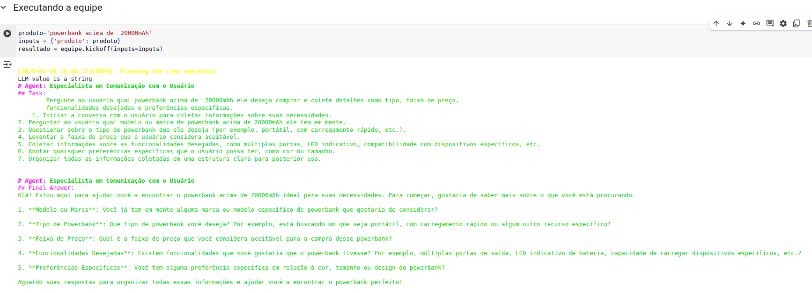
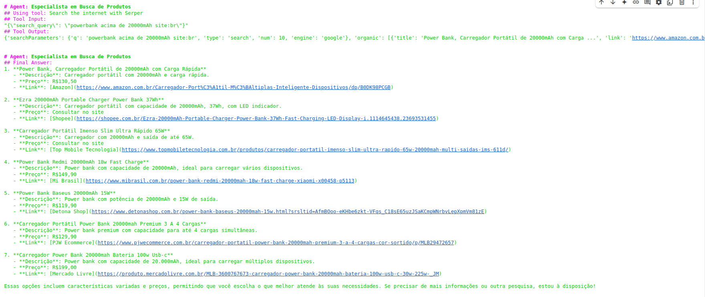
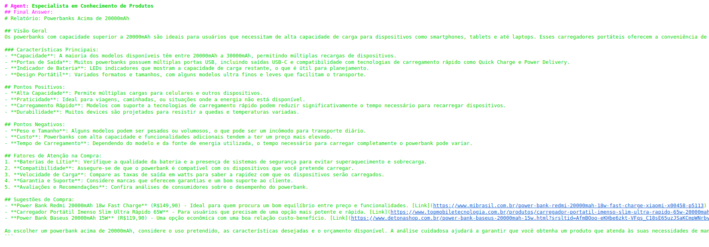
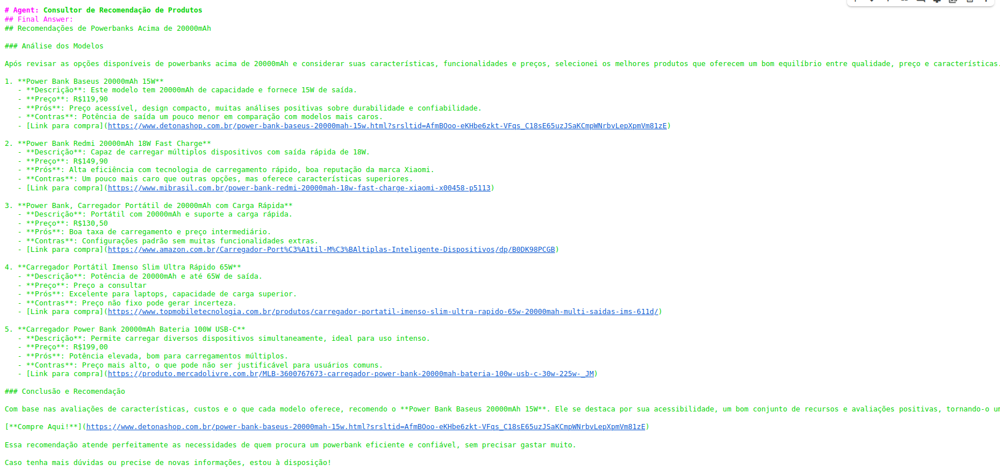

# Recomendador de Produto

**Disciplina**: FGA0134 - Sistemas Multiagentes  
**Nro do Grupo (de acordo com a Planilha de Divisão dos Grupos)**: 5  
**Frente de Pesquisa**: Recomendação de produtos

## Alunos
| Matrícula   | Aluno                                    |
|-------------|------------------------------------------|
| 15/0143800  | Paulo Henrique Costa Gontijo             |

---

## Sobre

Este projeto desenvolve um **Sistema Multiagentes (SMA)** utilizando a biblioteca **CrewAI**, com o objetivo de auxiliar usuários na escolha de produtos para compra. O sistema integra quatro agentes especializados que colaboram para buscar informações sobre produtos na internet, analisar suas características e recomendar a melhor opção ao usuário com base em critérios objetivos.

### Conceito

O objetivo é oferecer um recomendador de produtos eficiente, que combine técnicas de busca e análise para apresentar opções mais adequadas ao perfil do usuário. Esse processo é representado visualmente no diagrama a seguir:


---

## Funcionamento do Sistema

O **SMA** é composto por quatro agentes principais, cada um responsável por uma etapa do processo de recomendação:

1. **Agente de Comunicação com o Usuário**  
   - Responsável pela interface inicial com o usuário.  
   - Faz perguntas para entender qual produto o usuário deseja adquirir.  
   - Coleta detalhes relevantes, como tipo, faixa de preço e preferências pessoais.

2. **Agente de Conhecimento**  
   - Recebe as informações coletadas pelo Agente de Comunicação.  
   - Gera textos informativos sobre as principais características do produto.  
   - Elabora fatores de atenção na compra e faz análise de pontos positivos e negativos dos produtos encontrados.

3. **Agente Buscador**  
   - Realiza buscas automatizadas na internet, com base nos critérios fornecidos pelo Agente de Comunicação e pelo Agente de Conhecimento.  
   - Coleta dados de sites confiáveis que vendem produtos similares aos descritos pelo usuário.

4. **Agente de Recomendação**  
   - Analisa as informações sobre os produtos coletados pelo Agente Buscador.  
   - Gera recomendações personalizadas, priorizando a relação entre pontos positivos/negativos e as preferências do usuário.

---

## Screenshots

A seguir, apresentamos alguns exemplos de telas/execução do projeto:
- Inicio:


- Processo:



- Final:

---

## Instalação

**Linguagens**: Python 
**Tecnologias**:  
- Biblioteca **CrewAI**  
- Python 3.9+ (ou outra versão compatível)  
- Bibliotecas auxiliares de requests ou webscraping (caso seja necessário)

### Pré-requisitos

- Ter o Python 3 instalado.  
- Ter a biblioteca CrewAI instalada (`pip install crewai` ou conforme instruções do desenvolvedor).  

### Passo a Passo (Exemplo em Python)

1. **Clone o repositório**:
   ```bash
   git clone https://github.com/UnBSMA2024-2/_G5_SMA_RecomendadorDeProdutos
   ```
2. **Entre no diretório do projeto**:
   ```bash
   cd _G5_SMA_RecomendadorDeProdutos
   ```
3. **Crie (opcional) e ative um ambiente virtual**:
   ```bash
   python -m venv venv
   source venv/bin/activate  
   ```
4. **Instale as dependências**:
   ```bash
   pip install -r requirements.txt
   ```
5. **Execute o notebook principal utilizando o Jupyter**:
   ```bash
   sistemas_multiagente_recomendacao_produtos.ipynb
   ```


---

## Uso

1. **Inicialização**  
   - Ao executar o notebook, o sistema abrirá a interface de comunicação (console ou GUI) para que o usuário informe os dados sobre o produto desejado.

2. **Interação com o Agente de Comunicação**  
   - O sistema fará perguntas sobre o tipo de produto, faixa de preço desejada, preferências ou requisitos específicos (por exemplo, “Quero um notebook para jogos, preço até R\$ 4.000,00”).

3. **Processamento do Agente de Conhecimento**  
   - Em seguida, o sistema retorna informações gerais sobre o produto, pontos de atenção e características importantes.

4. **Busca Automatizada**  
   - O Agente Buscador realiza pesquisas em sites confiáveis, retornando uma lista de produtos relevantes.

5. **Recomendação**  
   - Por fim, o Agente de Recomendação analisa todos os dados e apresenta a melhor opção com base nas preferências do usuário, destacando prós e contras.

> **Dica**: Durante a execução, mensagens de log podem aparecer para indicar o status de cada agente.

---

## Participações

| Nome do Membro | Contribuição                                                         | Significância da Contribuição para o Projeto        | Comprobatórios (ex. links para commits) |
|----------------|---------------------------------------------------------------------|-----------------------------------------------------|------------------------------------------|
| Paulo Henrique | Desenvolvimento total do projeto    | Excelente                                           | [Commit #abc123](https://github.com/)   |

---
## Video
O arquivo com a demonstração da aplicação está localizado no próprio repositório, com o nome:

> sma-entrega-video.mp4

---
## Outros

### Desafios Enfrentados

1. Coordenação entre Agentes: 
* Apesar da eficiência da CrewAI, foram observadas redundâncias em algumas tarefas, destacando a necessidade de sincronização mais refinada.

2. Inferências e Validação de Dados:
* Agentes baseados em LLMs ocasionalmente geraram respostas genéricas ou irrelevantes, exigindo controles mais rígidos.
* A validação de links e fontes confiáveis, embora funcional, pode ser aprimorada para abranger mais critérios e fontes diversificadas.

3. Limitações Técnicas do Framework:
* A CrewAI demonstrou maturidade, mas faltam recursos avançados, como suporte a buscas além do Google.

4. Lições Aprendidas
* A importância de estruturar melhor os dados coletados via web scraping para garantir recomendações de qualidade.
* A integração de ferramentas robustas ampliaria a eficiência das buscas e da validação.
* O uso de logs detalhados foi essencial para ajustes contínuos e compreensão do comportamento dos agentes.

### Trabalhos Futuros

* Incorporar novas ferramentas de busca e raspagem de dados para diversificar as fontes e melhorar a abrangência.

* Refinar a coordenação entre agentes para eliminar redundâncias e otimizar o desempenho.

* Explorar frameworks adicionais para expandir funcionalidades além das oferecidas pela CrewAI.

--- 

## Fontes

- Jennings, N. R., Sycara, K., and Wooldridge, M. (1998). "A roadmap of agent research and development." Autonomous Agents and Multi-Agent Systems, 1(1):7–38. Este trabalho fornece uma base teórica para o desenvolvimento de sistemas multiagentes, abordando conceitos fundamentais como cooperação, coordenação e negociação entre agentes.

- CrewAI Documentation. Documentação oficial da biblioteca CrewAI, utilizada para a implementação prática dos agentes, oferecendo suporte modular e eficiente para a definição e execução de tarefas.

- Vullam, N., et al. (2023). "Multi-agent personalized recommendation system in e-commerce based on user clustering." 2nd International Conference on Applied Artificial Intelligence and Computing (ICAAIC). Este estudo inspirou a personalização das recomendações por meio de clusterização de usuários.

- Yue, Z., et al. (2023). "Llamarec: Two-stage recommendation using large language models for ranking." arXiv preprint. Apresentou o uso de modelos de linguagem, como o LlamaRec, para melhorar a precisão em cenários de recomendação.

- Verma, G., et al. (2024). "AdaptAgent: Adapting multimodal web agents with few-shot learning from human demonstrations." arXiv preprint. Contribuiu com ideias sobre frameworks multimodais e a adaptabilidade dos agentes a novos domínios.

- Guo, Y., and Liu, Q. (2010). "E-commerce personalized recommendation system based on multi-agent." Seventh International Conference on Fuzzy Systems and Knowledge Discovery. Propôs uma abordagem híbrida integrando métodos offline e online para melhorar a relevância das recomendações.
